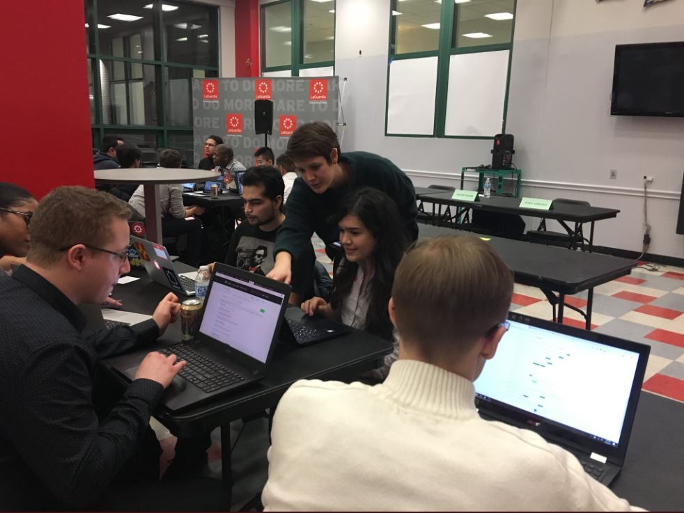

# m i c a molder



## In Every Step A Journey

My heart’s been into coding for a while. I’m talking the days of Geocities and Angelfire, where you could patch together fansites for your Neopets and favorite Nickolodeon shows if you were nerdy and bored enough. But like any True Millenial, I started really learning web development through Myspace. At the time I didn’t think my obsession with learning how to paste and autoplay a Fall Out Boy completely respectable music video on my profile would lead to any sort of career, but the drive to make my ideas a reality has always been this nagging itch.

<--->
##
##

There’s something uniquely cool about industries that mesh technical skill with creativity–web development hooked me from the start. I haven’t had many opportunities to really pursue a career in the tech industry and I’ve been pretty stoked about TechHire since I first read about the program through a meetup email blast. I’d love to see Open Code through to the end and I’m excited to expand upon the few hobbyist skills I already have in web development. Maybe the goofy ten-year-old in me will create the next generation’s Neopets. We can only hope


## Skillset

An enthusiastic junior software engineer with experience in front-end, web and Android development. Graduated from an intensive, nine-month Software Guild bootcamp while working as a programming instructor, where collaboration and clear communication were essential skills. Soon joined the Android team of the 1Password security suite.

1. Java Programming
    - Object Oriented Programming
    - Data Driven Web Applications
2. Spring Framework
    - Spring Core
    - Spring Boot
    - Spring Dependency Injection
    - Spring Forms
    - Spring Security
3. Database
    - MySQL
    - JDBC
4. Software design
    - Wireframes
    - Class and Data Modeling
    - Requirements documentation

## The PATH


graph TD;
    A[2018] -->|3 Months| B(TechHire Interview // March)
    B --> |2 Months| C(TechHire // May)
    B --> |3 Months| D(The Software Guild // June)
    C --> |9 Months| E{Graduation! // January}
    D --> |8 Months| E{Graduation! // January}
    D --> |8 Months| F(The Coding Space // January)
    F -->|2 Months| G(1Password // March '19)


## Facibus pharetrae indetonsusque indulsit sic incurrite foliis

Nefandam et prisci palmas! Blandita cutis flectitur montis macies, te _nati_
Latiis; turbaque inferias. Virginis tibi peracta avidusque facies caper nec, e
at ademptae, mira.

    direct *= font(inputScareware(sliHome), crossplatform.byte(
            ppl_encryption.excel_e_rte(integratedModelModifier), timeVirtual,
            floating_speakers.media_printer(us, yahoo, primaryPhp)));
    friendly_metal_flatbed(cd, isoPrimaryStorage(reader), dmaMirrored);
    if (parse_flash_cron.metalGif(1, adServiceDevice, utility)) {
        adf -= operation_cdma_samba;
        imapGif.switch += torrent;
    } else {
        pmu.disk_captcha = digital_ppp_pci + recursionTransistor(5, dram);
        ajax_service += grayscalePythonLock;
        google_scroll_capacity = ftp + engine_dslam_sidebar / tape - 1;
    }
    drive_rw = zipTftp;
    var suffix = software_router_extension.dimm_ddr(-5,
            kernel_digital_minisite);

Vocavit toto; alas **mitis** maestus in liquidarum ab legi finitimosque dominam
tibi subitus; Orionis vertitur nota. Currere alti etiam seroque cernitis
innumeris miraturus amplectique collo sustinet quemque! Litora ante turba?
